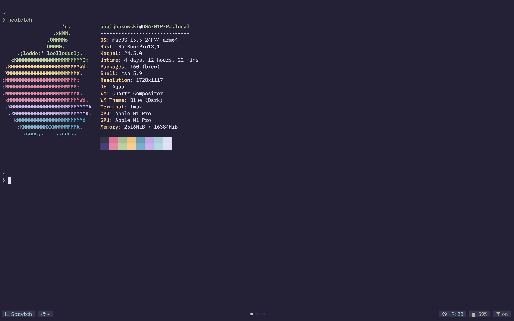
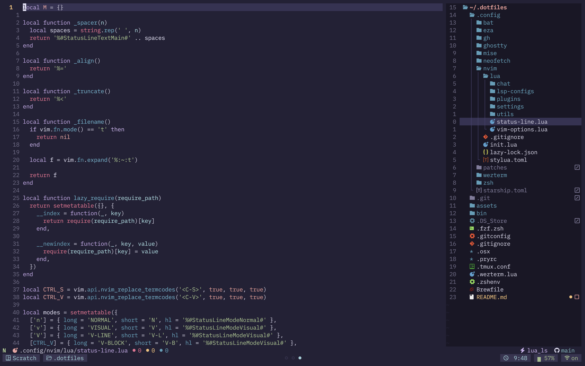

# 8BitTitan's personal dotfiles

This repository holds majority of my personal configuration for my MacOS setup. Including but not limited to:

- zsh (shell)
- [Homebrew](https://brew.sh) (MacOS package manager)
- [Neovim](https://neovim.io/) (editor)
- ~~Ghostty (terminal)~~
    - Currently using Wezterm
- [Wezterm](https://wezterm.org/) (terminal)
- [Starship](https://starship.rs/) (prompt)
- [tmux](https://github.com/tmux/tmux) (multiplexer)
- [mise](https://mise.jdx.dev/) (languages management)
- [eza](https://eza.rocks/) (better `ls`)
- [bat](https://github.com/sharkdp/bat) (better `cat`)
- git
- [yaak](https://yaak.app/) (API Client)

## Quickstart

To quickly get started with this setup, proceed with the following:

Clone the repository into your `$HOME` directory
```bash
git clone https://github.com/8bittitan/dotfiles.git ~/.dotfiles
```

Move into the created directory
```bash
cd ~/.dotfiles
```

Run the install script
```bash
./bin/setup_mac
```

## Screenshots

Terminal


Neovim

